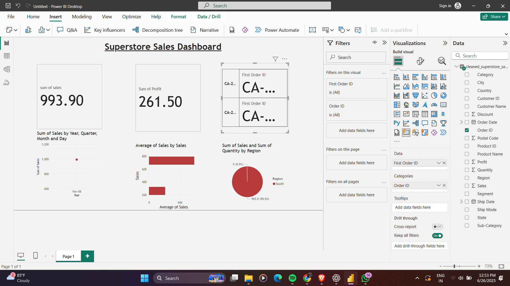

# 📊 Superstore Sales Dashboard – Task 3

### 🚀 Internship Task – Data Analyst | Elevate Labs

---

## 📌 Objective

Design an interactive dashboard using Power BI that helps business stakeholders analyze and visualize sales data, profit trends, and performance across different regions and categories.

---

## 🗃️ Dataset Used

- **Source**: [Kaggle – Superstore Dataset](https://www.kaggle.com/datasets/vivek468/superstore-dataset-final)
- **File Name**: `cleaned_superstore_sample.csv`  
- The dataset includes fields like Order ID, Sales, Profit, Region, Category, Sub-Category, Order Date, etc.

---

## 📊 KPIs Tracked

- ✅ Total Sales
- ✅ Total Profit
- ✅ Total Orders
- ✅ Sales by Region
- ✅ Profit by Category
- ✅ Monthly Trend Analysis

---

## 🧩 Features of the Dashboard

- 🎛️ **Slicers**: Region, Category, Sub-Category, Order Date
- 📈 **Visuals**: Cards, Line Charts, Bar Charts, Pie Chart
- 📅 **Time-Series**: Monthly sales and profit trends
- 🧠 **Insights**: Category-wise & region-wise performance
- 🎨 **Consistent Theme**: Clean layout and colors
- 🔁 **Fully Interactive**: Filters update visuals in real-time

---

## 📷 Dashboard Preview

---

## 📎 Files Included

- `dashboard.pbix` → Power BI file  
- `cleaned_superstore_sample.csv` → Cleaned dataset  
- `task3_summary.pptx` → Summary presentation  
- `screenshots/` → Dashboard preview images  
- `README.md` → You're reading it ✅

---

## 🔍 Key Insights

- 📈 Technology category has the highest sales.
- 📉 South region has the lowest profit margin.
- 🧾 Most orders come from the Consumer segment.
- 📆 Peak sales were observed in Nov 2017.

---

## 🛠️ Tools Used

- Power BI Desktop  
- Microsoft Excel (for cleaning)  
- Canva/PowerPoint (for summary slides)  
- GitHub (for submission)

---

## 🙋 Prepared By

**Name: Parampreet Singh Ahluwalia
**Internship: Data Analyst – Elevate Labs  
**Date: 26 June 2025
[LinkedIn Profile](https://www.linkedin.com/in/parampreet-singh-ahluwalia-0704582b1/)

---

